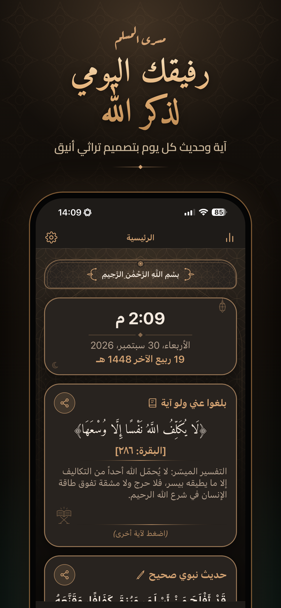
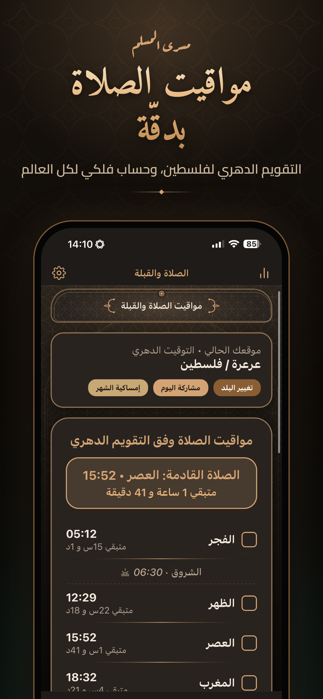
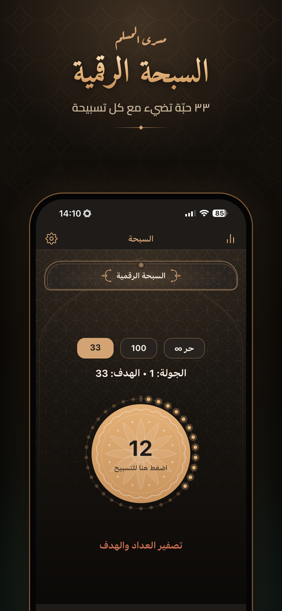
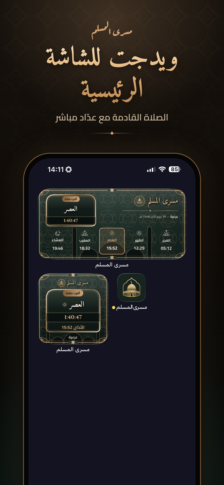
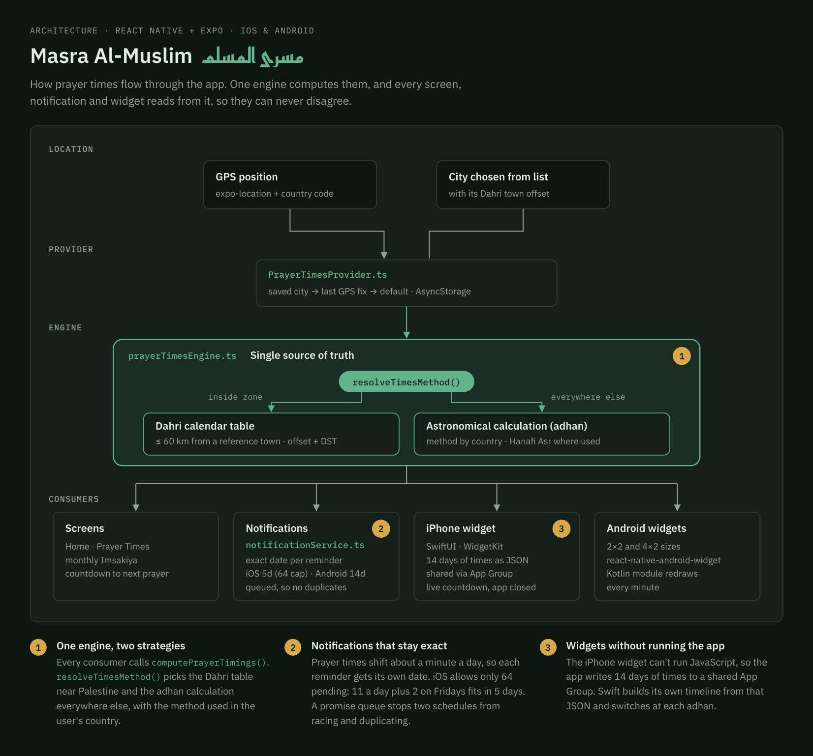

# Masra Al-Muslim (مسرى المسلم)

A daily Islamic companion app for iPhone and Android. It brings together the morning and evening adhkar (remembrances), accurate prayer times, the Qibla direction, a digital misbaha (prayer-bead counter), and a daily Quran verse, hadith and Name of Allah — all in an Arabic, heritage-inspired green-and-gold design, with home-screen widgets on both platforms.

The app has no accounts, no ads and no data collection: everything stays on the device.

**Available on the App Store:** [apps.apple.com/app/id6817377040](https://apps.apple.com/app/id6817377040)

<p align="center">
  
  
  
  
</p>

More screenshots, for iPhone and iPad, are in [`store/screenshots/`](store/screenshots).

---

## Features

- **Adhkar library.** Morning, evening, after-prayer, sleep and waking adhkar. Each dhikr has its own counter, and the app tracks daily progress.
- **Prayer times.** Accurate times for any location, from GPS or a city chosen from a list. It also shows a monthly timetable (Imsakiya), the next prayer with a countdown, the Duha window and the last third of the night. Today's times or the whole month can be shared as an image. See [How prayer times are calculated](#how-prayer-times-are-calculated).
- **Qibla compass.** A stable compass that combines the gyroscope with the magnetic heading, gives turn-left / turn-right guidance, and vibrates gently when the phone points at the Kaaba.
- **Digital misbaha.** Targets of 33, 100 or free counting. 33 animated beads light up one by one, with a gold pulse at the start of each new round.
- **Daily content.** A Quran verse with a short explanation, an authenticated hadith with its source and explanation, and all 99 Names of Allah, fully vocalised. Verses and hadiths can be shared as text or as image cards.
- **Reminders.** Local notifications for each prayer and for the adhkar. They are scheduled for each specific day, so they stay exact even though prayer times shift daily.
- **Home-screen widgets.**
  - iPhone: small and medium WidgetKit widgets with a live, second-by-second countdown.
  - Android: a 2×2 and a 4×2 widget, redrawn every minute.
- **Statistics.** A weekly summary, achievements, and a tracker for missed (qada) prayers.
- **Comfort.** Light and dark mode, adjustable text size and optional haptics.

---

## Architecture

<p align="center">
  
</p>

Prayer times are computed in exactly one place, and everything else reads from it, so the screen, the reminders and the widgets can never disagree.

1. **Location.** The user's position comes from GPS (with the country from reverse geocoding) or from a city picked from the list.
2. **Provider.** `PrayerTimesProvider` resolves which location to use (saved city → last GPS fix → default) from local storage, so background work such as widgets and notifications can compute times while the app is closed.
3. **Engine.** `prayerTimesEngine` is the single source of truth. `resolveTimesMethod()` chooses the Dahri calendar near Palestine and the astronomical calculation everywhere else.
4. **Consumers.**
   - **Screens:** show the result.
   - **Notifications:** scheduled for an exact date each day, within iOS's limit of 64 pending notifications.
   - **iPhone widget:** receives 14 days of times through a shared App Group and builds its own timeline in Swift.
   - **Android widgets:** compute their own times and are redrawn every minute by a small Kotlin module.

---

## How prayer times are calculated

All prayer times — on the screen, in the widgets and in the notifications — come from one module, `src/utils/prayerTimesEngine.ts`.

1. **In Palestine and its immediate surroundings** (within about 60 km of a reference town), times come from the traditional **Dahri calendar** table. Each town has its own offset of a few minutes. The table is written in Palestine standard time (UTC+2) and is converted to the phone's clock, which handles summer time automatically.
2. **Everywhere else**, times are **calculated astronomically** with the open-source [adhan](https://github.com/batoulapps/adhan-js) library. The calculation method is the one used in the user's country:
   - Saudi Arabia: Umm al-Qura
   - Egypt: Egyptian General Authority of Survey
   - USA and Canada: ISNA
   - Pakistan and India: Karachi, with the Hanafi Asr
   - other countries: Muslim World League

   High-latitude locations use adhan's recommended rule. The screen then says «حساب فلكي» (astronomical calculation) and names the method.

---

## Technology

- **Expo SDK 57** and **React Native**, written in **TypeScript**
- **Native widgets:**
  - iPhone: a SwiftUI WidgetKit extension (`targets/widget`), connected with `@bacons/apple-targets`
  - Android: `react-native-android-widget`, plus a small Kotlin Expo module that refreshes the widgets every minute
- **Notifications:** `expo-notifications`, with local notifications only (no server)
- **Sensors:** `expo-sensors` and `expo-location` for the compass and the location
- **Releases:** builds with **EAS Build**, and JavaScript-only changes shipped instantly with **EAS Update**

---

## Running the project

You need Node.js 20 or newer, npm, and an [Expo](https://expo.dev) account for builds.

```bash
npm install
npx expo start
```

The app uses native modules (widgets, notifications, sensors), so it needs a development build or a full build. Most features do not work in Expo Go.

### Building

The native `android/` and `ios/` folders are generated automatically and are not stored in the repository.

To build a test version for Android locally (on Linux or WSL):

```bash
export ORG_GRADLE_PROJECT_reactNativeArchitectures=arm64-v8a   # faster build, ~42 MB APK
eas build --platform android --profile preview --local
```

To build a test version for iPhone in the cloud (this needs an Apple Developer account, and the test devices must be registered first):

```bash
eas device:create
eas build --platform ios --profile preview
```

There are two build profiles:

- **preview:** test builds (an Android APK or an iOS ad-hoc build) that receive updates from the `preview` channel.
- **production:** store builds that receive updates from the `production` channel.

### Updating without a new build

Changes to JavaScript or TypeScript only (screens, text, data, designs) can reach users without going through the stores again:

```bash
eas update --branch preview      # test builds
eas update --branch production   # App Store / Google Play builds
```

A new build is needed after changing `app.json`, adding or removing native packages, or editing `modules/` or `targets/`.

### Releasing to the stores

```bash
eas build --platform ios --profile production
eas submit --platform ios
eas build --platform android --profile production   # .aab for Google Play
```

For Google Play, build without the `arm64-v8a` variable above, so the app supports every device.

Other release material:

- **Store listing:** the text, keywords and privacy answers are in [`store/listing.md`](store/listing.md).
- **Screenshots:** in [`store/screenshots/`](store/screenshots).
- **Public pages:** the privacy policy and support pages are in [`docs/`](docs), published with GitHub Pages. The privacy page is generated from the in-app text with `node scripts/build-policy-page.js`.

---

## Project structure

```
App.tsx, index.ts            App entry point; registers the Android widget handler
app.json, eas.json           Expo and EAS configuration
src/
  screens/                   Home, Prayer Times & Qibla, Adhkar, Misbaha, Statistics, Settings, About
  components/                Ornaments and backgrounds, the animated misbaha, shareable cards
  data/                      Adhkar, the Dahri timetable, verses, hadiths, Names of Allah
  services/                  Notification scheduling and the background prayer-times provider
  utils/                     Prayer-times engine, prayer status, Hijri dates, rating, statistics
  theme/                     Colours, styles and the background option
  widgets/                   Android widgets and the bridge that feeds the iPhone widget
modules/masra-widget-clock/  Kotlin module: exact per-minute refresh of the Android widgets
targets/widget/              iPhone widget (SwiftUI / WidgetKit)
store/                       Store listing text and screenshots
docs/                        Public privacy policy and support pages
scripts/                     Helper scripts (privacy page generator, colour switcher)
```

---

## Licence

Developed by **Mohamad Jammal**. Copyright © 2026, all rights reserved — see [LICENSE](LICENSE). Third-party libraries remain under their own licences.
